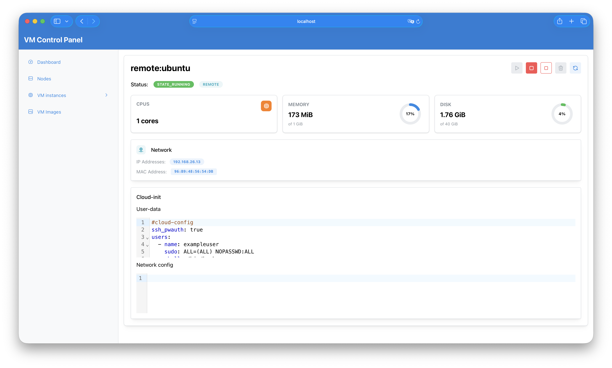
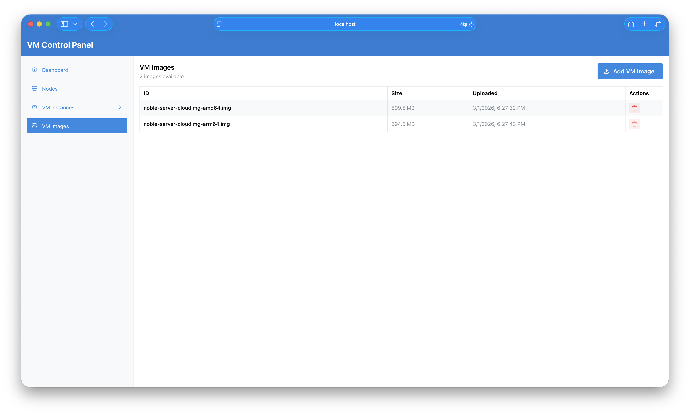

# QController Frontend

A modern React-based web interface serving as the official UI for QController, enabling real-time monitoring and management of QEMU virtual machines.

## ✨ Features

- **Real-time VM Monitoring** - Live updates via WebSocket connection using Protocol Buffers
- **VM Lifecycle Management** - Create, start, stop, and delete virtual machines
- **Image Management** - Browse and select from available VM images
- **Responsive Design** - Mobile-friendly interface with collapsible navigation
- **Type Safety** - Full TypeScript implementation with generated API clients
- **Modern UI** - Clean interface built with Mantine components

## 🛠 Tech Stack

- **Framework**: React 19.2 with TypeScript
- **Build Tool**: Vite 7.3 for fast development and optimized builds
- **UI Library**: Mantine 8.3 for components and theming
- **Routing**: React Router with nested routes
- **Real-time**: WebSocket with Protocol Buffers for efficient binary communication
- **Code Generation**:
  - OpenAPI Generator for REST API client
  - Buf for Protocol Buffer code generation

## 🚀 Getting Started

### Prerequisites

- Node.js (recommended: use `.nvmrc` with `nvm use`)
- Yarn package manager
- Running QController backend service

### Installation

1. **Install dependencies:**

   ```bash
   yarn install
   ```

2. **Generate API clients:**
   ```bash
   yarn generate <PATH_TO_QCONTROLLER_PROTOS> <PATH_TO_IMAGE_SERVICE_OPENAPI>
   ```

## 🔧 Development

### Available Scripts

- `yarn dev` - Start development server with hot reload
- `yarn build` - Build for production
- `yarn preview` - Preview production build locally
- `yarn lint` - Run ESLint and Prettier checks
- `yarn prettier` - Format code with Prettier
- `yarn generate` - Regenerate API clients and Protocol Buffer types

### Code Generation

The project uses code generation (OpenAPI and protobuf) for type-safe API communication.

### Environment Variables

- `PUBLIC_URL` - Vite base path for assets (default: `/ui/`)
- `BUILD_DIR` - Build output directory (default: `dist`)

### Screenshots



